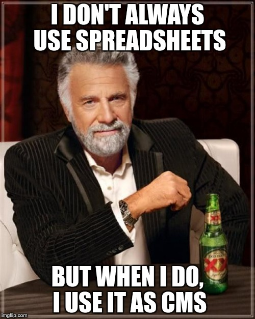
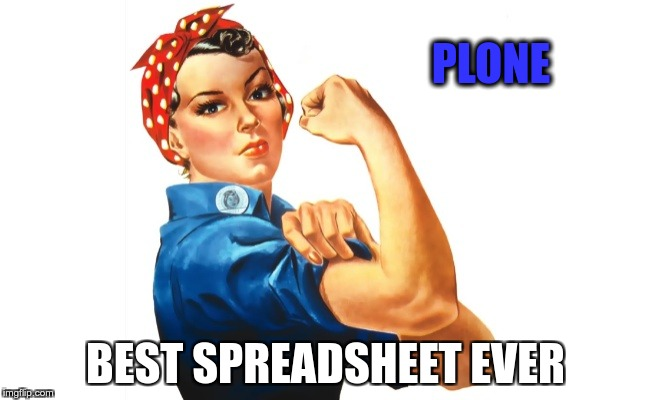
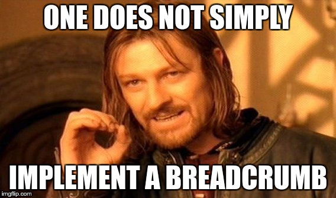
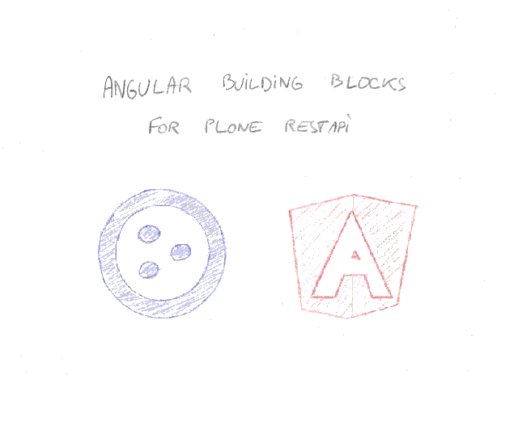

# This is 2017, let's go frontend!

## Eric Bréhault - PloneConf 2017

.fx: titleslide

# Presenter Notes

--------------------------------------------------------------------------------

# What frontend is about?

.fx: titleslide

# Presenter Notes

Just making better web sites. Period.

And we all want that.

That has always been the reason why we have been using JavaScript since the very beginning.

With time, frontend became an actual domain in the software industry.

But that's still what it is about.

Move to frontend dev is a game changer, you build better sites.

"Javascript is the future": we are not even talking about the future: javascript is now

So what about CMSes and frontend?

--------------------------------------------------------------------------------

# "Drupal is a Burning Platform?"

## "Nowadays Drupal is seen by many as the Sharepoint of the JavaScript generation"

# Presenter Notes

a tool they don't want to use, but one that is pushed to them by the enterprise

Many Drupal freelancers use a static file generator for simple sites.

"Oh yeah, Plone, my father used it a lot"

--------------------------------------------------------------------------------

# Hey, what about no-CMS!?

.fx: titleslide

# Presenter Notes

I have read a blog post where people explain (I think that was for a New York times website) they use Google Spreadsheet to manage the page content.

and they were saying that's great because 

- simple UI
- simple auth
- great API

--------------------------------------------------------------------------------

# Presenter Notes

Seriously ????!!!!

instead of using a CMS with excellent features, developed for decades, frontend dev prefer to use Google Spreadsheet as a backend

It sounds stupid to me.

But I talk with frontend developers, they are like: "Well that's cool"

"Yeaaah... noooo.... 
Imagine: workflow, access control, content-type definition, media management, etc."

--------------------------------------------------------------------------------

# They don't care

# Presenter Notes

They just don't care.

All the great things we spend years to build, all those features our users enjoy
and use every day.

THEY DON'T CARE

They prefer...

--------------------------------------------------------------------------------

# Re-implementing

# Presenter Notes

on every projects, they just re-start everytime from scratch

go through all the very same steps evrytime

So what can we do?

--------------------------------------------------------------------------------

# Ignore them

.fx: titleslide

# Presenter Notes

Could work ten years ago, but sorry, that's not an option anymore in 2017.

We all agree today that pure static HTML pages is not an option...

We do, right?

Moreover, most part of time, they are our colleagues, we have to work with them anyway.

--------------------------------------------------------------------------------

# Integrate frontend into Plone

.fx: titleslide

# Presenter Notes

Managing frontend process or best practices into Plone is very difficult, it costs a lot of time to implement

(by the time it is implemented, the JavaScript build chain tooling has moved away by 3 generations)

and the result is not effective for Plone developers, neither for frontend developers

I believed we could make Plone a good tool for frontend developers.

We have Diazo, Dexterity, Mosaic, I developed Rapido too. All very good stuff.

That's actually usable for a frontend dev, but compare to the productivity he/she can get when doing pure front, this is ridiculous.

And they don't enjoy it anyway.

So, not an option either.

We need to reconsider the whole thing. This Google spreadsheet thing, let's stop calling it stupid.

We need to stop this way of thinking.

If frontend dev like this approach (or similar ones), that's for good reasons.

--------------------------------------------------------------------------------

# Embrace it

# Presenter Notes

Let's make Plone as good as a spreadsheet in their point of view

"Plone: imagine the best spreadsheet ever!!"

And that's what we call headless CMS.

Headless CMS is about running a CMS as a backend service through an API

and the whole UI is pure frontend

--------------------------------------------------------------------------------

# It makes sense

.fx: titleslide

# Presenter Notes

ThoughWorks technology radar: "CMS as a platform" => HOLD!! https://www.thoughtworks.com/radar/platforms/cms-as-a-platform

"We are seeing too many organizations run into trouble as they attempt to use their CMS as a platform for delivering large and complex digital applications.

... We tend to recommend treating your CMS as a component of your platform (often in a hybrid or headless mode) cooperating cleanly with other services, rather than attempting to implement all of your functionality in the CMS itself."

So headless is the right approach regarding business.

But also regarding tech: we've been trying to mix backend and frontend (see mockup, resource registry, etc.)=> very difficult

--------------------------------------------------------------------------------

# What is the current headless CMS offer?

.fx: titleslide

# Presenter Notes

- Firebase? Actually, that's more about creating applications.
- Contentful? That's just a CRUD implemented in PHP!!
- CosmicJS? Do we expect our customers to manage their content in a Django admin like UI?
- GraphCMS => graphql is really great, but the cms here is very cheap

- Drupal headless => quite close to Contentful, it allows to build a site with its the theme, but the CMS features are not there

Just one small remark: none of them provide breadcrumbs.

Breadcrumbs seem like a small thing, but:

- it is very useful

- and ...

--------------------------------------------------------------------------------

# Presenter Notes

- it is very hard to implement

I have been to Mordor, I implemented it once.

That's exactly why we are more productive using a CMS rather than anything else.

--------------------------------------------------------------------------------

# Plone, doing breadcrumbs since 2001

.fx: titleslide

# Presenter Notes

Plone rocks!! It just does.

- excellent features (hierarchical content, flexible content-types, access control and workflow)
- secured
- opensource

Plone core is rich (it provides core things like persitency or auth, but also hierarchical content, flexible content-types, access control and workflow, permissions, media management, and breadcrumbs of course).

Many CMS have a very small core, and key features are provided by add-ons. So it makes it difficult for them to provide a good restapi based on the core.

--------------------------------------------------------------------------------

# Choosing a JS framework

.fx: titleslide

# Presenter Notes

There are many JS frameworks.

They are changing fast.

The tooling is changing fast too.

Picking the right one is difficult.

Too risky actually.

--------------------------------------------------------------------------------

# Not choosing a JS framework

.fx: titleslide

# Presenter Notes

We focus on the main ones: React and Angular.

We would be happy to provide a VueJS implementation too.

--------------------------------------------------------------------------------

# Don't waste energy

.fx: titleslide

# Presenter Notes

--------------------------------------------------------------------------------

# Example: theme

TBD: show package inherirance for Pastanaga

# Presenter Notes

--------------------------------------------------------------------------------

# @plone/restapi-angular

# Presenter Notes

Simple Angular 4 SDK to use the Plone RESTAPI and build web sites easily.

On GitHub Plone

- traversing
- BrowserView-like view registration
- z3c.form-like form library

--------------------------------------------------------------------------------

# Real-life example

https://ddt65.terralego.com/

Backend:

- Vanilla Plone 5
- content-types created TTW

Frontend:

- declare the needed views
- overrides few @plone/restapi-angular templates
- PDF generation!!

Management:

- initial data import with Postman
- daily changes with WebDAV

--------------------------------------------------------------------------------

# But web sites can also be totally different

- new UI are possible
- mobile apps
- electron apps
- ...

<a href="../teststarwars.mp4" target="_new">Example</a>

Plone PWA

--------------------------------------------------------------------------------

# Thank you

.fx: titleslide

# Presenter Notes

Talk: Title of Talk "This is 2017, let's go frontend!"
Description: In 2017, frontend development is everywhere, accomplishing great things and transforming the web. Still, many CMSes don't seem to embrace it totally. Plone offers nows an Angular SDK which brings all the power of Plone to frontend developers. This talk explains the core principles of the Plone Angular SDK, and details some real use cases.

• "Headless CMS: we do good spreadsheet"
• "I don't always use spreaWe need to stop this way of thinking.
Let's make Plone as good as a spreadsheet in their point of view
"Plone: imagine the best spreadsheet ever!!"
Example: the breadcrumbs "Plone, doing breadcrumbs since 2001" https://imgflip.com/memegenerator/36864359/We-can-do-it
dsheet, but when I do, I use it as a CMS"
• "Plone headless: like a spreadsheet with breadcrumbs"
• Plone RESTAPI for frontend developers

https://imgflip.com/memegenerator/The-Most-Interesting-Man-In-The-World
instead of using a CMS with excellent features, developed for decades, some frontend dev prefer to use Google Spreadsheet as a backend:
• simple UI
• simple auth
• API
-"Hey, we have good cmses, they do all those stuffs very well, since a long time"
-"Surprisingly enough, I don't give a shit"
I don't always use spreadsheets, but when I do, I use it as a CMS
It sounds stupid to me. But my frontend colleagues are like: "Well that's cool"
"Yeaaah... noooo...."
and then blablabla
We need to stop this way of thinking.
Let's make Plone as good as a spreadsheet in their point of view
"Plone: imagine the best spreadsheet ever!!"
Example: the breadcrumbs "Plone, doing breadcrumbs since 2001" https://imgflip.com/memegenerator/36864359/We-can-do-it
Reprendre l'argument marketing de plone.io

https://drupal.sh/drupal-burning-platform
"Nowadays Drupal is seen by many as the Sharepoint of the JavaScript generation - a tool they don't want to use, but one that is pushed to them by the enterprise"
Many Drupal freelancers use a static file generator for simple sites.
Dries stated Drupal is not for small site.

ThoughWorks technology radar: "CMS as a platform" => HOLD!! https://www.thoughtworks.com/radar/platforms/cms-as-a-platform
"We are seeing too many organizations run into trouble as they attempt to use their CMS as a platform for delivering large and complex digital applications. This is often driven by the vendor-fueled hope of bypassing unresponsive IT organizations and enabling the business to drag and drop changes directly to production. While we are very supportive of providing content producers with the right tools and workflows, for applications with complex business logic we tend to recommend treating your CMS as a component of your platform (often in a hybrid or headless mode) cooperating cleanly with other services, rather than attempting to implement all of your functionality in the CMS itself."

So headless is the right approach regarding business. But also regarding tech: we've been trying to mix backend and frontend (see mockup, resource registry, etc.)=> very difficult

Move to frontend dev is a game changer, you build better sites.
"Javascript is the future": we are not even talking about the future: javascript is now

Plone core is rich (it provides core things like persitency or auth, but also basic workflows, permissions, media management, breadcrumbs, etc.). Many CMS have a very small core, and key features are provided by add-ons. So it makes it difficult for them to provide a good restapi based on the core.

Example: the breadcrumbs "Plone, doing breadcrumbs since 2001" https://imgflip.com/memegenerator/36864359/We-can-do-it

And if you think you need backend technology to generate a PDF, think again.

We make frontend dev, and at the end we try to run it server-side.Why do we do that? Isn't crazy? We already do very good serverside for ages. Well, that's about the developer experience. It is better to create a site with Angular than Diazo and/or Python.

Drupal headless => just the theme, not the features

https://graphcms.com/ => graphql is really great, but the cms here is very cheap

Good things frontend brings to Plone:
• beautiful dynamic web sites
• approachability

Good things Plone brings to frontend:
• traversing
• pluggability

@plone/restapi-angular is a pretty nice MVP (that's Timo idea), it does work on prod at the moment, it allows to build an entire site efficiently

https://github.com/collective/collective.experimental_angular_pwa