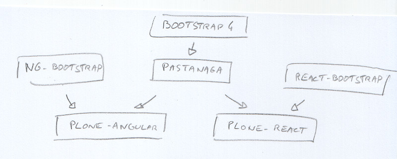

# This is 2017, let's go frontend!

## Eric Bréhault - PloneConf 2017

.fx: titleslide

# Presenter Notes

--------------------------------------------------------------------------------

# What frontend is about?

.fx: titleslide

# Presenter Notes

Just making better web sites. Period.

And we all want that.

That has always been the reason why we have been using JavaScript since the very beginning.

With time, frontend became an actual domain in the software industry.

But that's still what it is about.

Move to frontend dev is a game changer, you build better sites.

"Javascript is the future": we are not even talking about the future: javascript is now

So what about CMSes and frontend?

--------------------------------------------------------------------------------

# "Drupal is a Burning Platform?"

## "Nowadays Drupal is seen by many as the Sharepoint of the JavaScript generation"

# Presenter Notes

a tool they don't want to use, but one that is pushed to them by the enterprise

Many Drupal freelancers use a static file generator for simple sites.

"Oh yeah, Plone, my father used it a lot"

--------------------------------------------------------------------------------

# Hey, what about no-CMS!?

.fx: titleslide

# Presenter Notes

I have read a blog post where people explain (I think that was for a New York times website) they use Google Spreadsheet to manage the page content.

and they were saying that's great because 

- simple UI
- simple auth
- great API

--------------------------------------------------------------------------------

# Presenter Notes

Seriously ????!!!!

instead of using a CMS with excellent features, developed for decades, frontend dev prefer to use Google Spreadsheet as a backend

It sounds stupid to me.

But I talk with frontend developers, they are like: "Well that's cool"

"OK that's maybe cool, but think about: workflow, access control, content-type definition, media management, etc."

--------------------------------------------------------------------------------

# Presenter Notes

They just don't care.

All the great things we spend years to build, all those features our users enjoy
and use every day.

THEY DON'T CARE

They prefer...

--------------------------------------------------------------------------------

# Re-implementing

# Presenter Notes

on every projects, they just re-start everytime from scratch

go through all the very same steps evrytime

So what can we do?

--------------------------------------------------------------------------------

# Ignore them

.fx: titleslide

# Presenter Notes

Could work ten years ago, but sorry, that's not an option anymore in 2017.

We all agree today that pure static HTML pages is not an option...

We do, right?

Moreover, most part of time, they are our colleagues, we have to work with them anyway.

--------------------------------------------------------------------------------

# Integrate frontend into Plone

.fx: titleslide

# Presenter Notes

Managing frontend process or best practices into Plone is very difficult, costs a lot of time

(by the time it is done, the js build chain tooling has moved away by 3 generations)

and the result is not effective for Plone developers, neither for frontend developers

I believed we could make Plone a good tool for frontend developers (we have Diazo, Dexterity, Mosaic, Rapido . All very good stuff.)

That's actually usable for a frontend dev, but compare to the productivity he/she can get when doing pure front, this is ridiculous. And they don't enjoy it anyway. So, not an option either.

We need to reconsider the whole thing. This Google spreadsheet thing, let's stop calling it stupid.

We need to stop this way of thinking.

If frontend dev like this approach (or similar ones), that's for good reasons.

--------------------------------------------------------------------------------

# Presenter Notes

Last option: embrace it!

Let's make Plone as good as a spreadsheet in their point of view

"Plone: imagine the best spreadsheet ever!!"

And that's what we call headless CMS.

Headless CMS is about running a CMS as a backend service through an API

and the whole UI is pure frontend

--------------------------------------------------------------------------------

# It makes sense

.fx: titleslide

# Presenter Notes

ThoughWorks technology radar: "CMS as a platform" => HOLD!! 

"We are seeing too many organizations run into trouble as they attempt to use their CMS as a platform for delivering large and complex digital applications.

... We tend to recommend treating your CMS as a component of your platform (often in a hybrid or headless mode) cooperating cleanly with other services, rather than attempting to implement all of your functionality in the CMS itself."

So headless is the right approach regarding business.

But also regarding tech: we've been trying to mix backend and frontend (see mockup, resource registry, etc.)=> very difficult

--------------------------------------------------------------------------------

# What is the current headless CMS offer?

.fx: titleslide

# Presenter Notes

- Firebase? Actually, that's more about creating applications.
- Contentful? That's just a CRUD implemented in PHP!!
- CosmicJS? Do we expect our customers to manage their content in a Django admin like UI?
- GraphCMS => graphql is really great, but the cms here is very cheap

- Drupal headless => quite close to Contentful, it allows to build a site with its the theme, but the CMS features are not there

Just one small remark: none of them provide breadcrumbs.

Breadcrumbs seem like a small thing, but:

- it is very useful

- and ...

--------------------------------------------------------------------------------

# Presenter Notes

... it is very hard to implement

I have been to Mordor, I implemented it once.

That's exactly why we are more productive using a CMS rather than anything else.

--------------------------------------------------------------------------------

# Plone, doing breadcrumbs since 2001

.fx: titleslide

# Presenter Notes

Plone rocks!! It just does.

- excellent features (hierarchical content, flexible content-types, access control and workflow)
- secured
- opensource

And Plone core is rich (it provides core things like persitency or auth, but also image management, navigation, sitemap, etc., and breadcrumbs of course).

Many CMS have a very small core, and key features are provided by add-ons. So it makes it difficult for them to provide a good restapi based on the core.

--------------------------------------------------------------------------------

# Choosing a JS framework

.fx: titleslide

# Presenter Notes

There are many JS frameworks.

They are changing fast.

The tooling is changing fast too.

Picking the right one is difficult.

Too risky actually.

--------------------------------------------------------------------------------

# Not choosing a JS framework

.fx: titleslide

# Presenter Notes

We focus on the main ones: React and Angular.

We would be happy to provide a VueJS implementation too.

--------------------------------------------------------------------------------

# Don't waste energy

.fx: titleslide

# Presenter Notes

We cannot maintain by ourselves several entire implementations of the Plone UI.

We need to re-use as many things as possible:

- re-use external elements
- re-use elements between implementations

example:

--------------------------------------------------------------------------------

# Presenter Notes

Bootstrap 4 is just an example here, we are not decided yet.

--------------------------------------------------------------------------------

# @plone/restapi-angular

# Presenter Notes

Simple Angular 4 SDK to use the Plone RESTAPI and build web sites easily.

On GitHub Plone

- traversing
- BrowserView-like view registration
- z3c.form-like form library

--------------------------------------------------------------------------------

# Code example

    !html+ng2
    <header>
      <plone-global-navigation></plone-global-navigation>
      <plone-breadcrumbs></plone-breadcrumbs>
    </header>
    <main>
      <traverser-outlet></traverser-outlet>
    </main>

--------------------------------------------------------------------------------

# Code example

    !typescript
    export class PageComponent extends ViewView {
      displayLocalNav = true;

      onTraverse(target) {
        if (!target.context.text && target.context.items) {
          this.displayLocalNav = false;
        } else {
          this.displayLocalNav = true;
        }
      }
    }

--------------------------------------------------------------------------------

# Code example

    !html+ng2
    

      

        
      

    

    

      <h1>{{ context.title }}</h1>
      
{{ context.description }}

    

--------------------------------------------------------------------------------

# Real-life examples

.fx: titleslide

--------------------------------------------------------------------------------

# French local territory risk management

.fx: titleslide

# Presenter Notes

<a href="https://ddt65.terralego.com/" target="_new">Go</a>

Backend:

- Vanilla Plone 5
- content-types created TTW

Frontend:

- declare the needed views
- overides few @plone/restapi-angular templates
- And if you think you need backend technology to generate a PDF, think again.
- server-side rendering with Universal
- SEO friendly

Management:

- initial data import with Postman
- daily changes with WebDAV + content-rules

--------------------------------------------------------------------------------

# Innovation contest registration

.fx: titleslide

# Presenter Notes

<a href="https://concours.madeeli.fr/concours/les-inn-ovations-2017/" target="_new">Go</a>

- existing information system
- huge Plone site
- still Plone 4

--------------------------------------------------------------------------------

# But web sites can also be totally different

.fx: titleslide

# Presenter Notes

<a href="../plone-mindmap.mp4" target="_new">Example</a>

- new UI are possible
- mobile apps
- electron apps
- ...

Plone PWA

--------------------------------------------------------------------------------

# Where are we now?

.fx: titleslide

# Presenter Notes

plone.restapi-angular is a pretty advanced SDK and we use it in production.

Plone React focuses on the Plone UI and already reproduces the majority of the Plone 5 screens.

We want to maintain this multi-frameworks approach

--------------------------------------------------------------------------------

# What we learnt

.fx: titleslide

# Presenter Notes

Good things frontend brings to Plone:

- beautiful dynamic web sites
- it makes Plone fun again to many people (approachability)

Good things Plone brings to frontend:

- old ideas like traversing or pluggability, which make so much sense but nobody get it
- a really really good CMS API

A friend of mine (a frontend dev) told he tried almost all the commercial headless CMS, and they all have very limited features.

That's where we need to go, there is a market here. We have the knowledge, we have the technology, so let's go!!

--------------------------------------------------------------------------------

# Thank you

.fx: titleslide

# Presenter Notes
