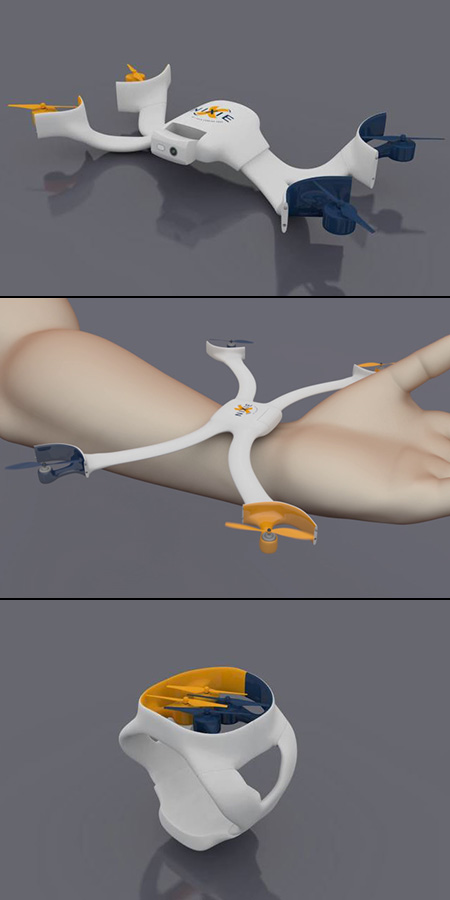

# Building a cathedral over decades

## Eric Bréhault - PloneConf 2017

.fx: titleslide

# Presenter Notes

Hola a tots. I would love to do my talk in catalan, but my catalan is very bad, I will continue in english.

My english is pretty bad too, but speaking bad english is a french tradition I respect a lot.

--------------------------------------------------------------------------------

# Think about our situation

We are developping and maintaining a CMS.

--------------------------------------------------------------------------------

# What is a CMS?

# Presenter Notes

It looks like a simple feature supported by a precise and quite complex mechanism.

Web frameworks are like that too, right?

But CMS are not just like frameworks.

Maybe let's put it that way...

--------------------------------------------------------------------------------

# What is a CMS?

# Presenter Notes

A CMS looks like a simple feature.

And... it is supported by a precise and quite complex mechanism.

Yeah... or let's say...

--------------------------------------------------------------------------------

# What is a CMS?

# Presenter Notes

It's a simple feature. Yes...

And its mechanism is precise and quite complex.

--------------------------------------------------------------------------------

# Does it fly?

.fx: titleslide

# Presenter Notes

At some point, the user comes to us, take a good look to our product, and ask:

"Does it fly?"

We: "It is not meant to."

User: "Oh really? well..."

--------------------------------------------------------------------------------

# Presenter Notes

"Your product is quite similar to this, right?"

--------------------------------------------------------------------------------

# Presenter Notes

"Well, it can fly. Definitely"

--------------------------------------------------------------------------------

# Presenter Notes

But our product is a little more complex than his.

And we start thinking: "Could it fly AND be backward compatible?"

--------------------------------------------------------------------------------

# ... and we add a new piece in our CMS

.fx: titleslide

# Presenter Notes

--------------------------------------------------------------------------------

# Presenter Notes

--------------------------------------------------------------------------------

# A very large stack

.fx: titleslide

# Presenter Notes

Zope 2, ZCA, ZODB, CMF, Dexterity, you name it.

Some of them have been around for 15 years.

That's probably half of the age of more than a half of the people here.

But that's clearly more than twice the age of the average JS framework.

--------------------------------------------------------------------------------

# This slide is pointless, ignore it

--------------------------------------------------------------------------------

# A long story

<a href="../teststarwars.mp4" target="_new">Open</a>

# Presenter Notes

For those who discover Plone today, it might look like it always has been that
way. For us, it is more like a saga....

A long time ago, in a GitHub organization far,
far away....

PLONE

Episode VI

A NEW ZOPE

Archetypes empire has vanished. In his absence, the Zope community has risen from the ashes of the CMF and will not rest until the last Python 2.7 egg is migrated to Python 3.
With the support of the Plone API, General Leia Dexterity leads a brave res(t)istance. She is desperate to find her brother Luke ZCA and gain his help in restoring peace and justice to the ZODB.
Leia has sent her most daring RESTAPI on a secret mission to the outer frontend world, where an old ally has discovered a clue to JavaScript rendering....

--------------------------------------------------------------------------------

# So, that's what a CMS is

.fx: titleslide

# Presenter Notes

Coming back to my original question, that's what a CMS is.

Complex features, a large stack, and a long story.

Yeah, a mess...

--------------------------------------------------------------------------------

# Facing new challenges

.fx: titleslide

# Presenter Notes

Remember the "Does it fly?" thing, well it keeps on happening.
What's up at the moment?

--------------------------------------------------------------------------------

# Moving Plone to Python 3

.fx: titleslide

# Presenter Notes

yes, but how?

--------------------------------------------------------------------------------

# Zope4, Guillotina?

.fx: titleslide

# Presenter Notes

--------------------------------------------------------------------------------

# Offering a full REST API approach

.fx: titleslide

# Presenter Notes

and what about a GraphQL implementation?

--------------------------------------------------------------------------------

# Frontend

.fx: titleslide

# Presenter Notes

There is no way to work with web right now without a strong frontend expertise.

You know what? We do not have a lot of frontend expertise in the community?

--------------------------------------------------------------------------------

# A bad situation?

.fx: titleslide

# Presenter Notes

Does it sounds like a bad situation?

What would you think of such a situation on a business project?

You would think it is very bad, and the team would probably be not highly motivated.

--------------------------------------------------------------------------------

# Opensource is not business

.fx: titleslide

# Presenter Notes

The business world is violent, fast and disruptive, it hurts.

Opensource takes time, it takes to know people, to care about people, to collaborate over time, it heales.

--------------------------------------------------------------------------------

# Thank you

# Presenter Notes

Ramon: "My idea is to have something mixed from how a community faces the situation we are right now, large stack, maintaining backward compatibility for 12 years, lack of frontend expertise, headless, guillotina, zope 4,... so it can be abstracted in general up to finally explain how great is the plone community :)"
Building a cathedral: like la Sagrada Familia: conceived by someone who left, but still under construction, and every part makes sense.
Disrupting the disruption
dire bonjour en catalan, mais dire que mon catalan est mauvais donc je continue en anglais, même s'il est mauvais aussi, mais c'est une tradition française
the startup world is violent, fast and disruptive, it hurts
opensource takes time, it takes to know people, to collaborate over time, it heales
cura, care vs incuria, free time vs business
startups value 10x developers, super-men. OS value collective. Only way to be a 10x dev is to teach 10 dev how to be 2x better.
Some of you are not in the Plone community, so you might not know what is a real community.
Not just sharing code, we are sharing emotion. Emotions are mental and physiologic, they are what make our mind and our body a single thing, and what make us able to share with others (empathy=ability to feel what someone else feel, it is not a rational decision, it is also physiologic, it also works with animals).
Being part of something, just like fan groups, or cosplay people: they spend a lot of time, is it useful? they don't care, they just want to be part of something, because it improves ourselves and makes us feel good.
Human want to share, want to help (le don de sang payant par exemple, pendant la préhistoire, on prenait soin des handicapés, etc.), the myth of rational egoistic individual is a hoax. and if you ask those who beleive in it, they say "That's human nature", but ask them if they are also egoistic regarding the family, they say "no, of course", but what is the perimeter of your family? what if it is actually larger than you think? this fraternity, that's human nature.
How Plone survived? Our complex tools and concepts are pharmakas, memory of the past, they are barriers but also helpful to solve today's issues. 
Utilser http://makina-corpus.com/blog/metier/archives/quel-prix-devient-vraiment-pluggable
Une communauté est un organisme autonome, qui exerce sa volonté de puissance (au sens de Nietzche, will to power), quand elle rencontre ses limites, elle les repousse