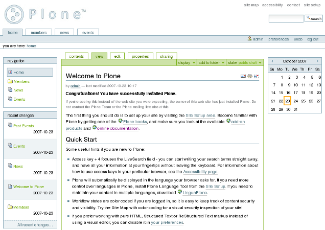

# Plone, 15 d'expérience feront toujours la difference

## Eric Bréhault - PyConFr 2017

.fx: titleslide

--------------------------------------------------------------------------------

# L'ancien Plone

# Presenter Notes

Si vous êtes assez vieux pour savoir à quoi le titre fait réference, quand on vous dit "Plone" vous pensez à ça.

Et pour les autres, vous ne savez pas ce que c'est.

--------------------------------------------------------------------------------

# Le temps des CMS

.fx: titleslide

# Presenter Notes

Tous les CMS sont vieux.

On travaille dans un domaine où tout a tendance à mal vieillir, mais pourtant les CMS les plus utilisés affichent tranquillement 10 ans au compteur.

Pourquoi ?

Parce que les CMS ont beau être de vieilles choses, ce sont des vieilles choses qui marchent bien.

Les technos changent vite, mais les cas d'utilisation de base restent stables, et surtout restent valides, c'est-à-dire que les attentes et les usages ne changent pas beaucoup.

--------------------------------------------------------------------------------

# Pas de demi-mesure

.fx: titleslide

# Presenter Notes

au début il faut juste pouvoir éditer des pages

puis on se rend compte qu'il faut aussi gérer les médias

ah et puis un workflow de validation

du coup il faut aussi pouvoir gérer les droits

il faudra aussi une newsletter

une zone de partage de documents en accès restreint

le multilingue

la possibilité de faire des sous-sites qui seraient exactement pareils sauf deux ou trois trucs

un accès WebDAV ça serait bien cool aussi

--------------------------------------------------------------------------------

# La marche est haute

.fx: titleslide

# Presenter Notes

- les use cases sont très nombreux et plutôt rigides (les habitudes sont là, difficile de déroger)

- la partie technique est énorme

du coup c'est dur pour des nouveaux de se positionner

donc il reste qui ? les vieux

car ils ont:

- une communauté éduquée à ce qu'est un CMS (par exemple qui sait que les sites statiques en markdown ça marche pas en vrai))

- une stack solide (buildout, ZCA, etc.)

Aujourd'hui, on en est au point où un type de contenu développé en Dexterity peut être ajouté dans un autre développé en Archetypes, répondre à un évènement envoyé par un composant grok, et être modifié dans une browser view z3c.form, et tout cela par la simple grâce d'avoir installé les eggs correspondants (autrement dit d'en énumérer les noms dans le buildout.cfg, et sans aucune ligne de code).

Parmi les technos listées ici, certaines ont 10 ans d'écart. Et ça tient.

--------------------------------------------------------------------------------

# Mais on ne s'endort pas

.fx: titleslide

# Presenter Notes

alors on en est où?

--------------------------------------------------------------------------------

# Démo Plone 5

# Presenter Notes

--------------------------------------------------------------------------------

# Les enjeux d'aujourd'hui

.fx: titleslide

# Presenter Notes

passage au front

headless

mais pourquoi ?

--------------------------------------------------------------------------------

# "Drupal is a Burning Platform?"

https://drupal.sh/drupal-burning-platform

"PHP is increasingly not the first language that new web developers pick up. Instead JavaScript has become the dominant new language, and this is an area where Drupal is playing catch-up at best with it's aged front end architecture"

"Nowadays Drupal is seen by many as the Sharepoint of the JavaScript generation - a tool they don't want to use, but one that is pushed to them by the enterprise."

--------------------------------------------------------------------------------

# Les solutions

.fx: titleslide

# Presenter Notes

--------------------------------------------------------------------------------

# 2 backends possibles

.fx: titleslide

# Presenter Notes

--------------------------------------------------------------------------------

# Zope 4

Migration complète de la stack actuelle à Python 3.6

# Presenter Notes

--------------------------------------------------------------------------------

# Guillotina

- pas de Zope
- pur headless
- aiohttp
- ZODB-like au-dessus de PostgreSQL / Cockroach
- ElasticSearch

# Presenter Notes

ré-écriture complète mais limité au coeur (pas besoin de produire du HTML, on ne fait que du JSON)

--------------------------------------------------------------------------------

# Une seule API REST

.fx: titleslide

# Presenter Notes

ça marche déja, on s'en sert en prod

--------------------------------------------------------------------------------

# Frontend multi frameworks

- Angular
- React
- la prochaine star de dans 2 semaines

# Presenter Notes

--------------------------------------------------------------------------------

# Frontend multi frameworks

- Angular
- React
- la prochaine star de dans 2 semaines

# Presenter Notes

On arrive sur le frontend avec notre culture.

Quand on dit: le routing c'est pas suffisant, il faut du traversal, personne ne comprend

Pluggabilité: what?

--------------------------------------------------------------------------------

# Mais pourquoi Plone alors ?

.fx: titleslide

# Presenter Notes

pourquoi pas Django DRF, ou Kinto, ou Firebase ou Contentful ?

parce qu'on sait ce que c'est qu'un CMS: de base on fournit des contenus hiérarchiques, des types de contenus dynamiques, du contrôle d'accès granulaire, des workflow. Et des breadcrumbs !!!!

--------------------------------------------------------------------------------

# Plone, doing breadcrumbs since 2001

.fx: titleslide

--------------------------------------------------------------------------------

# PloneConf 2017 à Barcelone

<a href="file:///home/ebr/Bureau/ploneConfBercelona.pdf">Du 16 au 22 octobre.</a>

Training gratuit !!

--------------------------------------------------------------------------------
